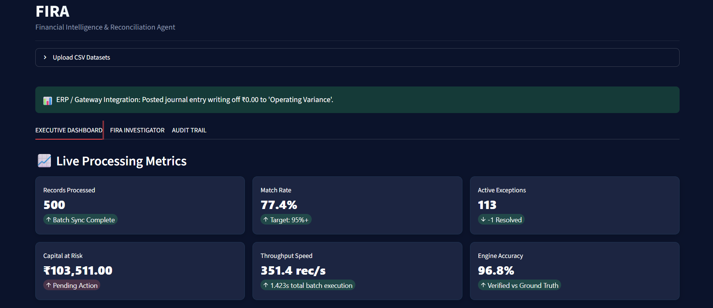
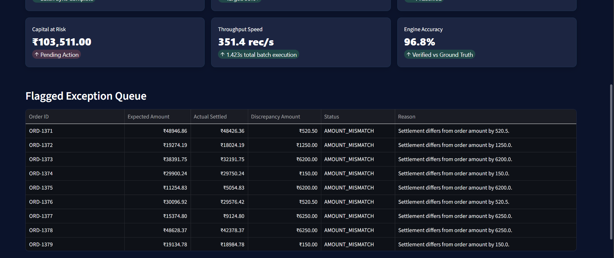
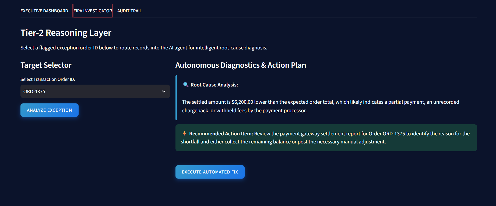
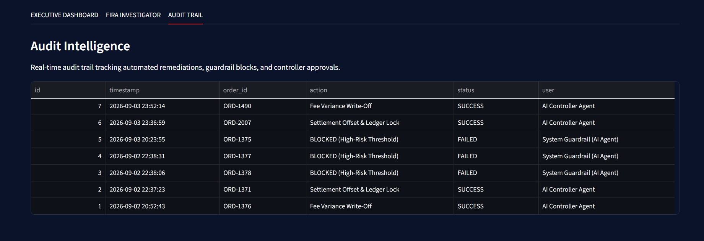

# 💳 FIRA — Financial Intelligence & Reconciliation Agent

> **AI Finance Controller for 3-way financial reconciliation, exception investigation, risk-aware remediation, and audit tracking.**

FIRA is an AI-driven finance operations platform that automates the reconciliation loop across **merchant orders, payment gateway transactions, and bank settlements**.

It performs deterministic financial reconciliation, identifies discrepancies, investigates complex exceptions using an AI reasoning layer, applies risk-based remediation, and maintains a persistent audit trail of important finance operations.

---
##  Product Preview

### Executive Dashboard



##  What FIRA Solves

### Investigator Dashboard


### Audit Dashboard


Finance teams often need to verify whether the same transaction is correctly represented across multiple financial systems.

Manual reconciliation requires:

- Comparing records across multiple sources
- Identifying amount discrepancies
- Finding missing or duplicate transactions
- Investigating settlement differences
- Deciding how an exception should be resolved
- Maintaining an audit history

FIRA automates this workflow while keeping financial decisions controlled and explainable.

### Core Principle

> **Rules decide. AI investigates. Humans govern high-risk actions.**

The deterministic reconciliation engine handles objective checks such as identifiers, amounts, dates, duplicates, and reconciliation status.

The AI reasoning layer is used for exception investigation, root-cause analysis, remediation recommendations, and finance-related questions.

---

#  System Architecture

```text
┌──────────────────────────────────────────────────────────────────────┐
│                       FIRA STREAMLIT FRONTEND                        │
│                                                                      │
│ Dashboard │ CSV Upload │ FIRA Investigator │ Audit Trail            │
└──────────────────────────────┬───────────────────────────────────────┘
                               │
                               │ HTTP / JSON / Multipart
                               ▼
┌──────────────────────────────────────────────────────────────────────┐
│                         FASTAPI BACKEND                              │
│                                                                      │
│ Upload │ Normalize │ Reconcile │ Analyze │ Remediate │ Audit Logs   │
└──────────────────────────────┬───────────────────────────────────────┘
                               │
                               ▼
┌──────────────────────────────────────────────────────────────────────┐
│                DETERMINISTIC RECONCILIATION ENGINE                  │
│                                                                      │
│ ID Normalization → Candidate Matching → Amount/Date Checks          │
│                         ↓                                            │
│              Duplicate Detection → Exception Classification         │
└──────────────────────────────┬───────────────────────────────────────┘
                               │
                 ┌─────────────┴─────────────┐
                 │                           │
              Match                    Exception Found
                 │                           │
                 │                           ▼
                 │                 ┌─────────────────────┐
                 │                 │ FIRA Reasoning      │
                 │                 │ Engine               │
                 │                 │                     │
                 │                 │ Root Cause Analysis │
                 │                 │ Resolution Suggest. │
                 │                 │ Finance Q&A         │
                 │                 └──────────┬──────────┘
                 │                            │
                 │                            ▼
                 │                 ┌─────────────────────┐
                 │                 │   Risk Guardrail    │
                 │                 └──────────┬──────────┘
                 │                            │
                 │                ┌───────────┴───────────┐
                 │                │                       │
                 │             Low Risk               High Risk
                 │                │                       │
                 │                ▼                       ▼
                 │         Automated Fix          Human Controller
                 │                │                       │
                 └────────────────┴───────────┬───────────┘
                                              │
                                              ▼
                                  ┌────────────────────────┐
                                  │     SQLite Audit       │
                                  │        Store           │
                                  └────────────────────────┘
```

---

#  Core Features

## 1. 3-Way Financial Reconciliation

FIRA cross-references:

```text
Merchant Orders
      ↓
Payment Gateway Transactions
      ↓
Bank Settlements
```

The system verifies whether expected amounts, captured payments, and actual settlements agree.

---

## 2. Custom CSV Data Ingestion

FIRA supports custom financial datasets through the Streamlit interface:

```text
order.csv
gateway.csv
bank.csv
```

The backend:

- Parses uploaded CSV files using Pandas
- Normalizes column names
- Handles missing and null values
- Aligns records across sources
- Performs multi-source reconciliation

---

## 3. Deterministic Exception Detection

FIRA detects objective reconciliation issues including:

- **Amount mismatch**
- **Missing record**
- **Duplicate transaction**
- **Settlement date variance**
- **Unmatched transaction**

The financial truth is established using deterministic program logic rather than an LLM.

---

## 4. FIRA Investigator

When an exception requires deeper investigation, the FIRA reasoning layer analyzes the transaction context.

It provides:

- Root-cause analysis
- Exception explanations
- Resolution recommendations
- Risk considerations
- Finance-related natural-language answers

### Investigation Flow

```text
Exception Detected
       ↓
FIRA Investigator
       ↓
Root-Cause Analysis
       ↓
Resolution Recommendation
       ↓
Risk Evaluation
       ↓
Automated Fix / Human Review
```

---

## 5. Risk-Aware Exception Remediation

FIRA does not blindly automate every financial action.

Low-risk exceptions can be eligible for automated remediation, while high-value or high-risk discrepancies are blocked and escalated to a human controller.

Example:

```text
Discrepancy: ₹6,200
Risk Threshold: ₹5,000

→ Automated remediation blocked
→ Escalated to Senior Controller
→ Action recorded in audit trail
```

> **Automate what is safe. Escalate what is risky.**

---

## 6. Persistent Audit Trail

FIRA maintains a SQLite-backed audit trail for important finance-operations events, including:

- Automated remediation actions
- Guardrail blocks
- Controller approvals
- System events
- Resolution history

The audit interface provides a chronological view of recorded actions and statuses.

---

#  Evaluation

FIRA was evaluated on a synthetic financial batch containing **500 records**.

| Metric | Result |
|---|---:|
| Records Processed | **500** |
| Matched Records | **386** |
| Exceptions | **114** |
| Match Rate | **77.2%** |
| Measured Accuracy | **96.8%** |
| Processing Time | **1.293 sec** |
| Total Discrepancy Amount | **₹103,511** |

### Metric Definitions

**Match Rate**  
Percentage of processed records classified as matched by the reconciliation engine.

**Measured Accuracy**  
Agreement between the engine's anomaly classification and the synthetic ground-truth labels used for evaluation.

**Exceptions**  
Records that require investigation, remediation, or human review.

> FIRA intentionally reports unresolved exceptions instead of forcing records into matches. The goal is measurable verification and transparent exception handling.

---

#  AI Reasoning Architecture

FIRA separates deterministic financial checks from AI reasoning.

A transaction is first evaluated by the reconciliation engine:

```text
Transaction Data
       ↓
Deterministic Checks
       ↓
Match / Exception
```

Only exceptions requiring additional reasoning are passed to the AI layer:

```text
Exception
    ↓
FIRA Reasoning Engine
    ↓
Root Cause
    ↓
Recommended Resolution
```

This approach keeps objective financial checks reproducible while using AI where contextual reasoning provides additional value.

---

#  Tech Stack

| Layer | Technology |
|---|---|
| Frontend | Streamlit |
| Backend | FastAPI, Uvicorn, Pydantic |
| Data Processing | Pandas, NumPy |
| AI Reasoning | Google Gemini API |
| Database | SQLite |
| Communication | REST / HTTP |
| Language | Python 3.10+ |

---

#  Project Structure

```text
fira-financial-agent/
│
├── backend/
│   ├── main.py
│   ├── audit_db.py
│   ├── generator.py
│   ├── llm_reasoner.py
│   ├── models.py
│   ├── normalizer.py
│   └── reconciler.py
│
├── frontend/
│   └── app.py
│  
│
├── data/
│   ├── bank_settelments.csv
│   ├── merchant_orders.csv
│   └── payment_records.csv
│
├── .env.example
├── .gitignore
├── requirements.txt
├── README.md
└── LICENSE
```

---

#  Operational Workflow

```text
1. Upload / Load Financial Data
             ↓
2. Normalize Records
             ↓
3. Perform 3-Way Reconciliation
             ↓
4. Detect Exceptions
             ↓
5. Investigate Complex Exceptions
             ↓
6. Evaluate Risk
             ↓
7. Remediate or Escalate
             ↓
8. Record Action in Audit Trail
```

---

#  Security

FIRA uses environment variables for API credentials.

The actual API key must never be stored in source code or committed to GitHub.

Example:

```env
GOOGLE_API_KEY=api_key
```

The repository uses synthetic financial data and does not contain real customer or banking information.

---

#  Engineering Challenge

One development challenge was inconsistent transaction identifiers across different sources.

For example:

```text
REF_ORD-1001
1001
```

could refer to the same underlying transaction while failing a simple exact string comparison.

FIRA addressed this by introducing an identifier normalization layer that converts source-specific references into a canonical representation before reconciliation.

Bounded amount and settlement-date tolerances were also introduced where appropriate.

A second important design decision was separating deterministic reconciliation from AI reasoning. Instead of using an LLM for every transaction, FIRA uses deterministic logic for objective financial checks and invokes AI only when deeper exception investigation is useful.

---

#  Design Philosophy

FIRA is built around three principles:

### Deterministic First

Financial truth should come from reproducible rules and data checks.

### AI Where Reasoning Helps

AI is used for root-cause investigation, contextual analysis, and resolution recommendations.

### Human Oversight for Risk

High-risk financial actions are blocked from automatic execution and routed to human controllers.

---

## FIRA

### **Reconcile. Resolve. Control.**